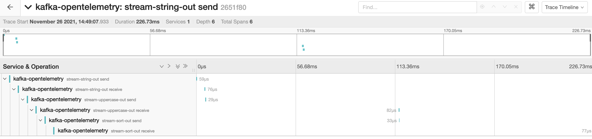

## Quarkus project to use OpenTelemetry with KafkaStream

### Start jaeger

in jaeger directory, start the docker-compose:

```shell
docker-compose up -d
```

Jaeger UI is available [here](http://localhost:16686/)

### Start the application

```shell
./mvnw compile quarkus:dev
```

### Workflow

* produceData send Hello X message to stream-string-out every seconds
* stream-string-out is consumed, value is transformed to upper case and send to stream-uppercase-out
* stream-uppercase-out is consumed, value is sorted and send to stream-sort-out
* stream-sort-out is consumed, value is logged and not send.

### Result



### How does it work

We define a KafkaClientSupplier that will be used when our stream is created:

```java
 @Produces
public KafkaClientSupplier kafkaClientSupplier(){
    return new KafkaStreamClientSupplier();
    }
```

When we call getProducer and getConsumer, it will return a Producer / Consumer wrapped into a
TracingKafkaProducer or a TracingKafkaConsumer.

This will link current and previous trace.
